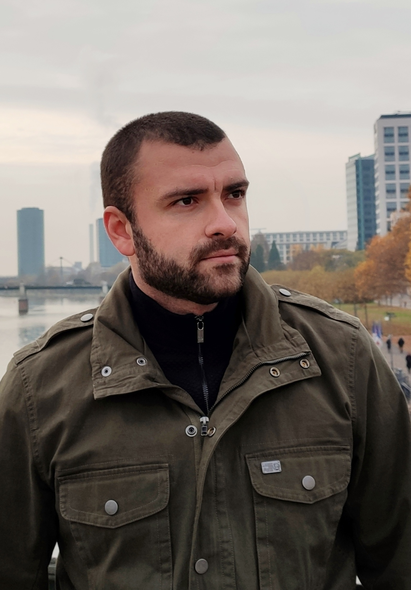

# GRIGORIOU THEOCHARIS
 - ## AUTOMATION ENGINEER 

 - ## Personal Information

Address : Stratigou Sarafi 35 , Thessaloniki Greece

Phone   : **+30 6958356857**

Email   : std138899@ac.eap.gr

 - ## Education

**2019 - Present :** Pervasive and Mobile Computing Systems MSc , Hellenic Open University

**2009 - 2016    :** Alexander Technological Education Institute of Thessaloniki

> -Bachelor of enginnering - Automation Engineer Technology/Technician

 - ## Work Experience

**2016 - Present :** *Automation Enginner*

   
 - ## Technical Skills

| Programming language | level | 
| ------------- | ------------- | 
| Java | Good | 
| C++ | Very Good  | 
| Python  | Good | 

 - ## Seminars attending
- [x] Arduino

 - ## Spoken languages
  Language | Level
------------ | -------------
 English | Very Good
 German  | Medium
 Greek   | Native

## Hobbies

### Photography

